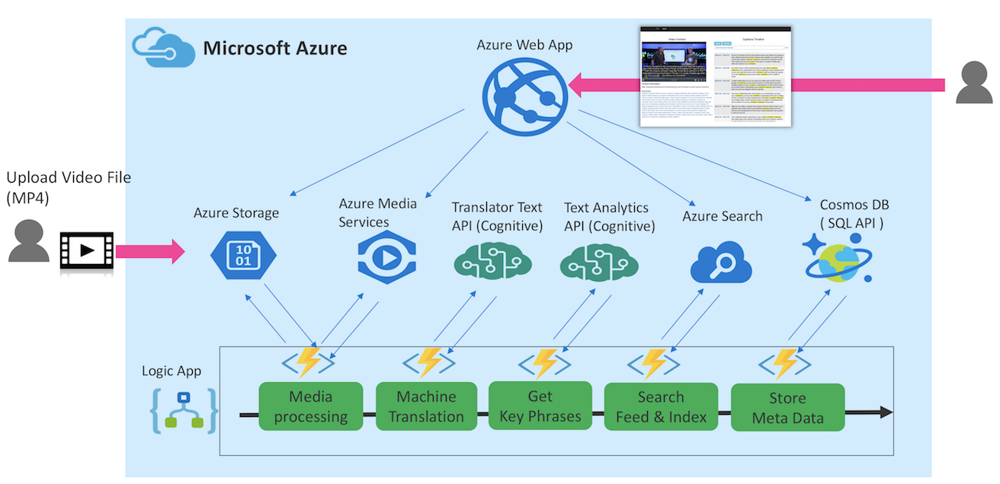
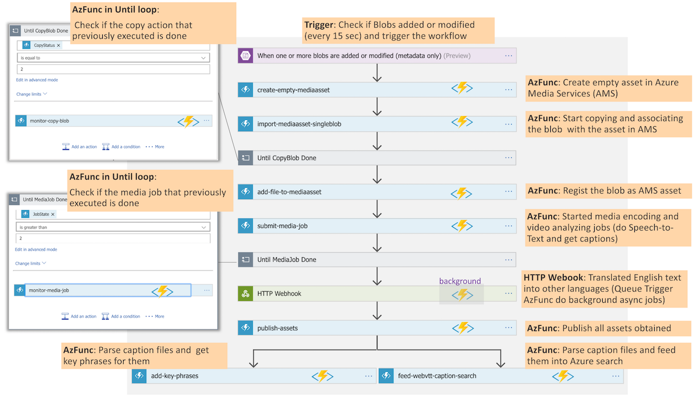
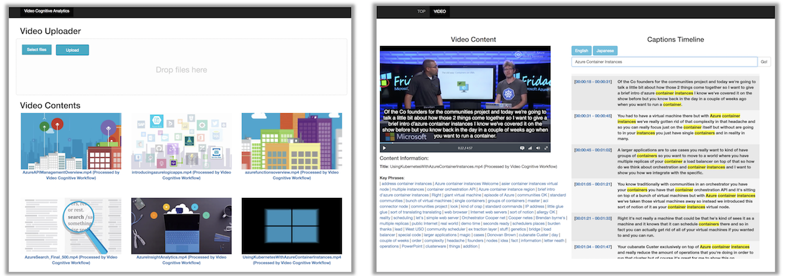

# Azure-Serverless-Video_AI_Transcription_Key_Topic-Pipeline_WebApp
Video_AI: Azure 'Serverless' Pipeline with 'WebApp' based on Php for Video_AI with Video Transcription and Key_Topic detection

Showcase Application of Serverless Video Analytics Workflow using Azure Functions, Logic App, and other multiple Azure Services

## Application Overview
### Architecture

Related Azure Services in the solution:
- Azure Functions
- Azure Logic App
- Azure Cosmos DB
- Azure Search
- Azure Media Services
- Azure Web App
- Azure Storage (Blob, Queue)
- Azure Text Analytics API (Cognitive Services)
- Azure Translator Text API (Cognitive Services)

### Logic Apps Workflow

### Web App UI

See also [Application Overview Video @ Youtube](https://www.youtube.com/watch?v=fgtBhoMGZBE)

## Deployment Procedures
- [How to deploy the demo application](docs/HOW-TO-DEPLOY.md)
